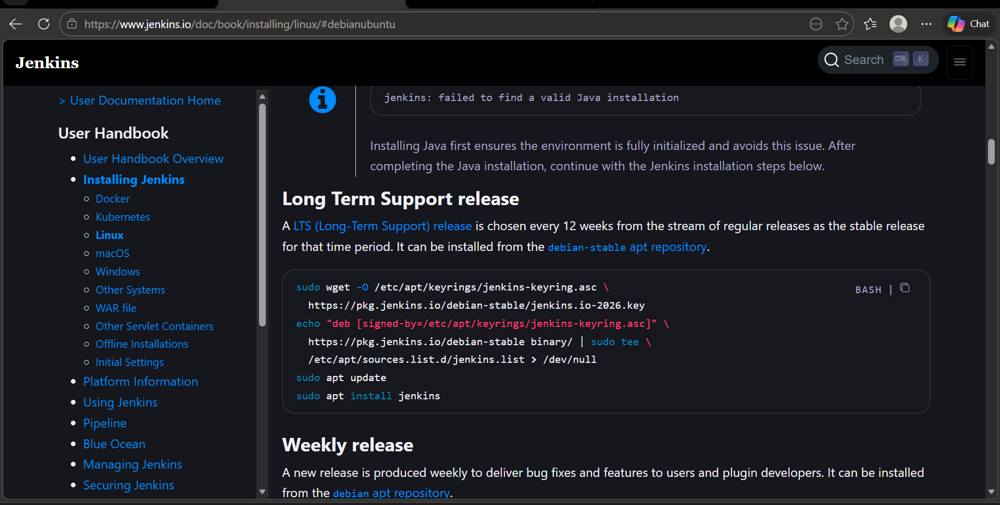
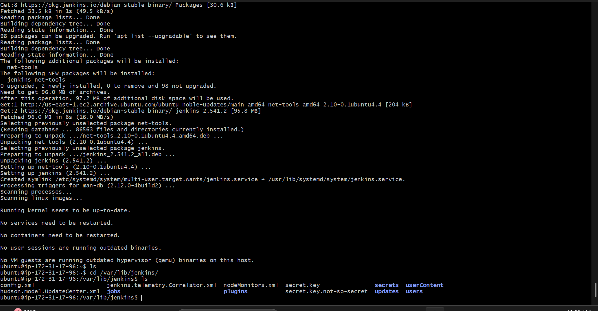
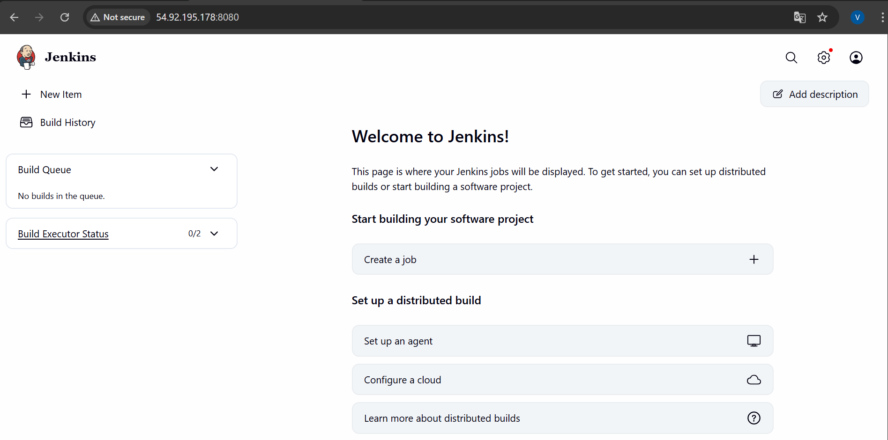
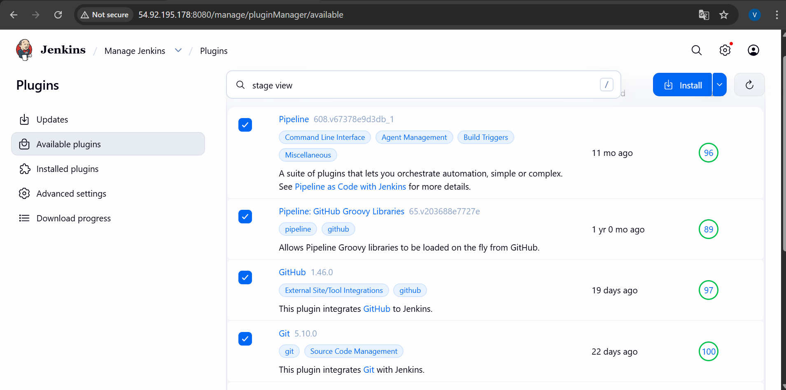
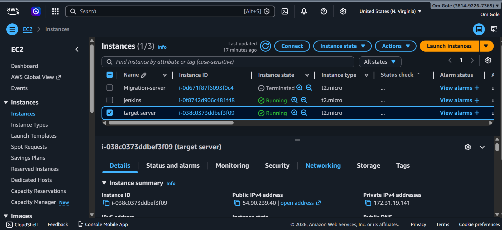
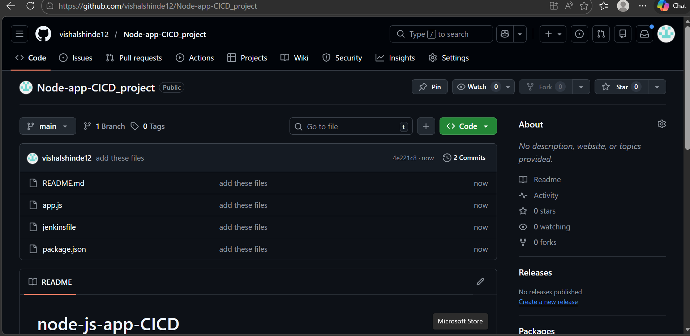
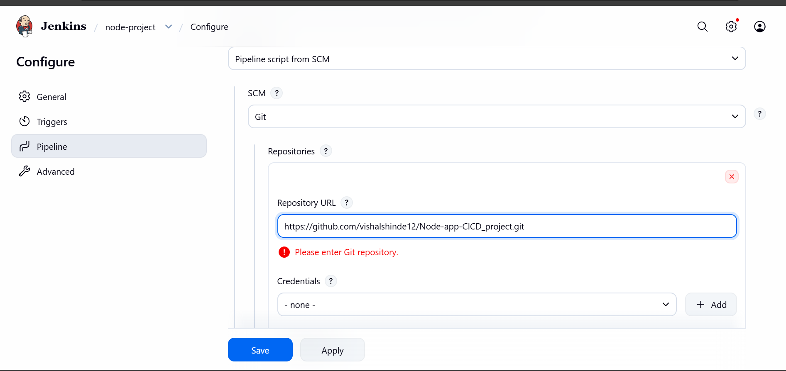
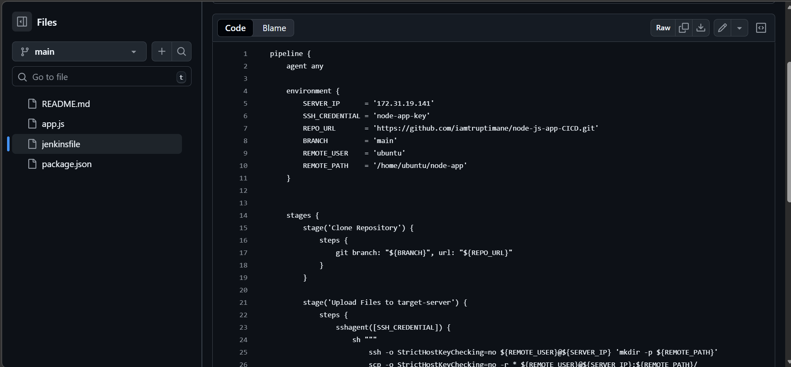
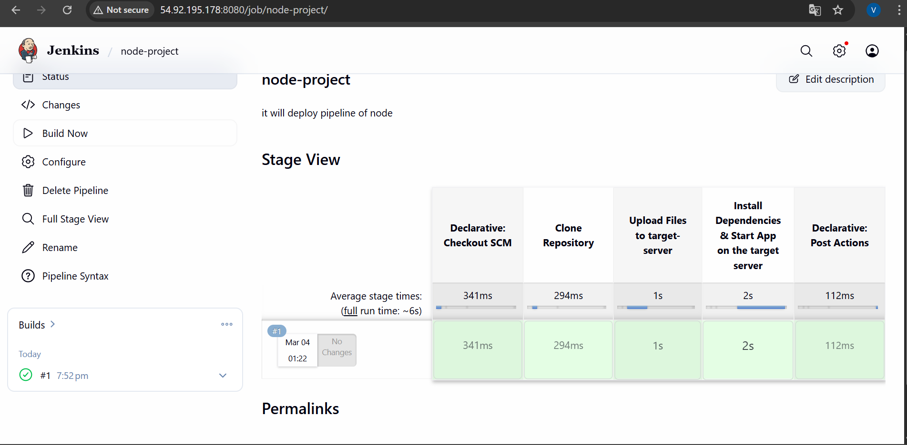
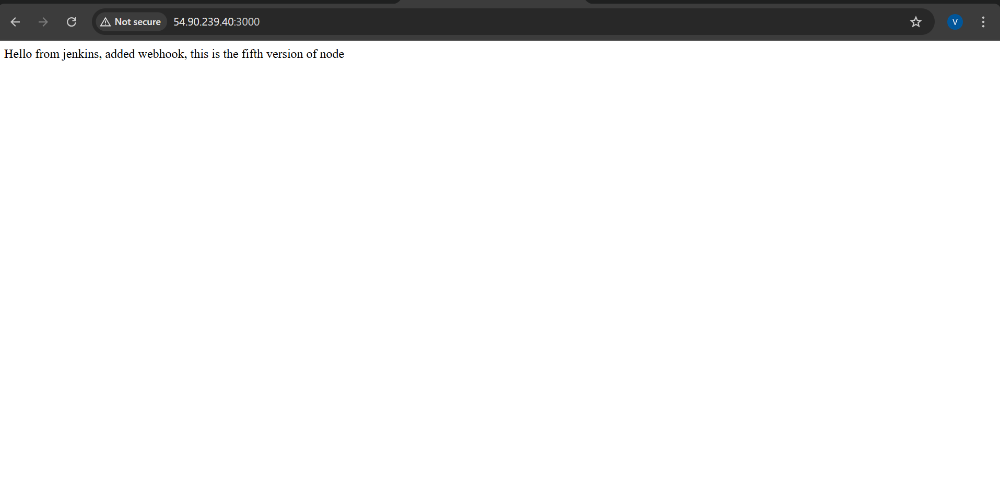

## Nodeapp Deployment using Jenkins on Target server

### Introduction :

#### This project demonstrates the end‑to‑end deployment of a Node.js application using a Jenkins CI/CD pipeline, integrated with GitHub for source control and enhanced by essential Jenkins plugins. Beyond automated builds and testing, the pipeline is configured to deliver the application directly to a target server, ensuring smooth and reliable deployment in a real‑world environment.


### Steps : 

#### Step 1 : Installation of Jenkins on ubuntu os

```
# Install Java (REquired for Jenkins)

# Add Jenkins Repository

# Install Jenkins

# Start and Enable Jenkins

# Add Port 8080 in existing Security Group
```


#### Step 2 : Getting Access of Jenkins dashboard
```
# On Browser 
Public_ip:8080
```


#### Step 3 : Installing Plugins for specialized functionality
```
# Plugins - Extend Jenkins functionality by integrating external tools and adding new features.

# Pipeline plugin - Defines automated CI/CD workflows as code.

# Stage View plugin - Provides a visual representation of pipeline stages and their execution status.

# Git plugin - Enables Jenkins to clone, fetch, and manage code from Git repositories.

# SSH Agent plugin- Provides SSH key authentication to connect Jenkins jobs with remote servers or repositories.
```


#### Step 4 : Launch a Target server 
```
install
# nodejs, npm, pm2 in the Target server
```


#### Step 5 : Give the ssh credentials to jenkis for accessing the Target server
```
# Go to the settings

# In credentials give the name of your credential
like "node-app-key"

# Add the private key

# Save the credentials
```


#### Step 6 : Create a new Item in Jenkins 

```
# Use pipeline plugin to create new item or job

# Use the GitHub repo where the application and jenkins file is store

# also give the exact name of jenkins file which given in GitHub

# save the job 
```




#### Step 7 : Update the jenkins file
```
# Give the Environment Variables
Server_ip, Repo_URL, Branch, Remote_user
```



#### Step 8 : Build the job



#### Step 9 : Using public Ip of the Target server access the apoplication on internet




